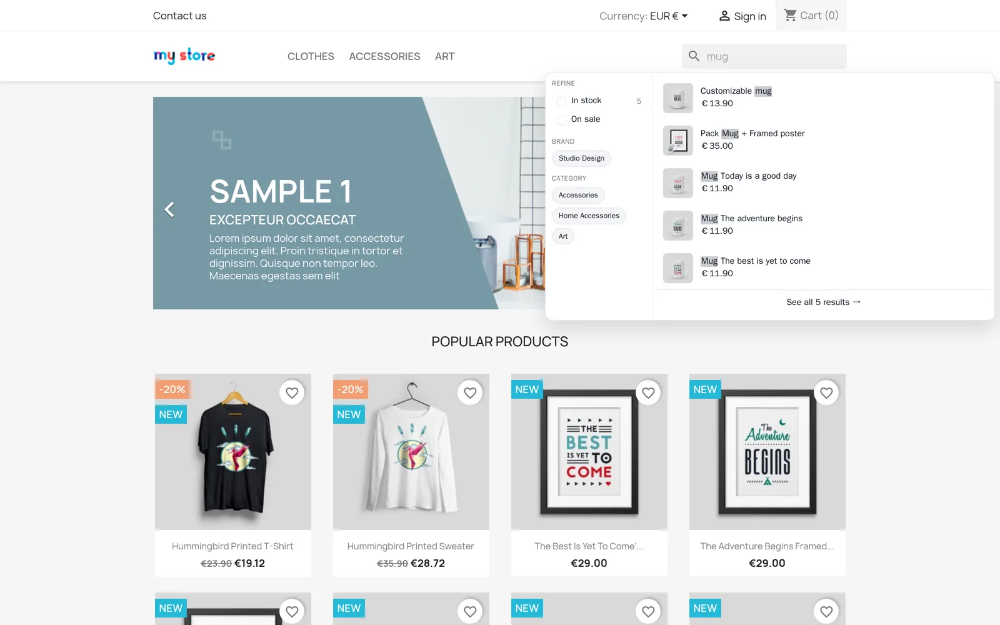

<p align="center">
  
</p>

<h1 align="center">NitroSearch for PrestaShop</h1>

<p align="center">
  <strong>Amazon-quality search for PrestaShop.</strong><br>
  Instant, typo-tolerant product search served from the cloud — without adding load to your shop.
</p>

<p align="center">
  <a href="https://nitrosearch.io/prestashop">nitrosearch.io</a> &nbsp;·&nbsp;
  <a href="https://nitrosearch.io/pricing">Pricing</a> &nbsp;·&nbsp;
  <a href="https://nitrosearch.io/legal/privacy">Privacy</a> &nbsp;·&nbsp;
  <a href="CONTRIBUTING.md">Contributing</a>
</p>

<p align="center">
  <a href="https://github.com/NitroSearch/nitrosearch-for-prestashop/releases/latest"></a>
  
  
  <a href="LICENSE"></a>
</p>

---

<p align="center">
  
</p>

NitroSearch is a hosted search service. This module syncs your PrestaShop catalogue to it and lets it
serve instant, typo-tolerant search and filtering to your shoppers — every query goes straight from
the browser to our engine, so your own server is never in the search path.

## Install

PrestaShop has no central module directory, so the module installs from a downloaded ZIP.

1. Download `nitrosearch-<version>.zip` from the
   [Releases page](https://github.com/NitroSearch/nitrosearch-for-prestashop/releases).
2. In your back office go to **Modules → Module Manager → Upload a module**, and drop the ZIP in.
3. Open the module's **Configure** screen and press **Connect**.

That is the whole setup. The first sync starts on its own; on a large catalogue it works through in
the background rather than all at once.

## Keeping it in sync

The module sends catalogue changes to NitroSearch in small batches. It does that two ways, and you
only need to think about the first:

**Set up cron (recommended).** Point your host's scheduler at the URL shown on the module's
configure screen, every five minutes:

```bash
*/5 * * * * curl -s "https://your-shop.example/index.php?fc=module&module=nitrosearch&controller=cron&token=YOUR_TOKEN" >/dev/null
```

The token is unique to your shop and is on the configure screen. Treat it as private — anyone with
it can make your shop do sync work.

**Without cron it still works.** The module falls back to doing a little sync work after a page has
already been sent to a shopper — at most one batch every 90 seconds, and always after the page is
complete, so nobody ever waits for it. It is slower on a first sync of a large catalogue, and that
is the only difference.

## What gets sent

Products and, if you switch them on, CMS pages. For each: name, description, price, SKU/reference,
brand, categories, stock and sale state, image and link — plus each combination's SKU, price and
attributes.

**Prices are sent exactly as your shop displays them**, tax included or excluded according to your
own settings. NitroSearch performs no tax calculation of any kind; it indexes and shows the number
you send, so what a shopper sees in search matches your product page.

Nothing about your customers or their orders is sent by the sync.

## Why there is a queue

Changes are written to a small local table first, then sent in batches — never during the save
itself. A product save, a bulk edit, a CSV import and a checkout all stay fast, and your shop keeps
recording changes correctly even if NitroSearch is briefly unreachable.

**And the module does not trust those change signals to be complete.** PrestaShop fires different
hooks depending on how a product was changed, and some ways — the CSV importer, direct SQL from an
ERP connector, certain third-party modules — fire nothing we can see. So there is also a full
catalogue walk that does not depend on any hook, and it is what makes the sync correct rather than
merely prompt. It runs on install, on demand, and whenever the service notices something is missing.

## Uninstalling

Uninstalling disconnects the shop and drops the module's local queue table. Your products, pages and
settings are untouched.

## Contributing

Bug reports and pull requests are welcome — see [CONTRIBUTING.md](CONTRIBUTING.md).

## Licence

[AFL-3.0](LICENSE), the standard licence for PrestaShop modules.
